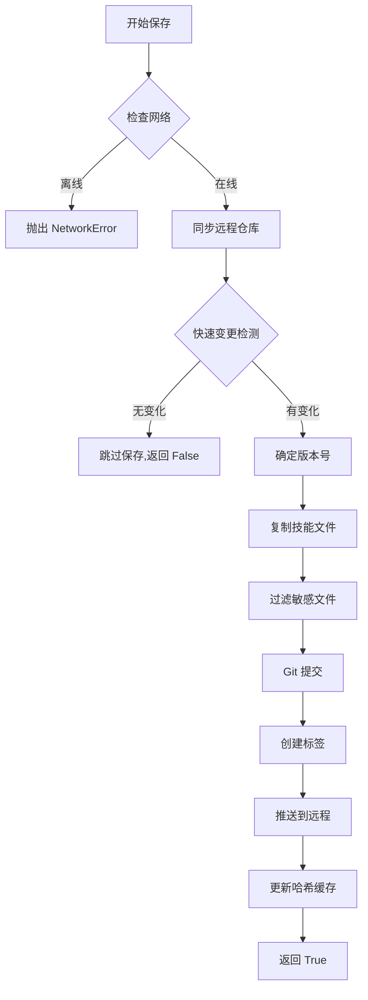
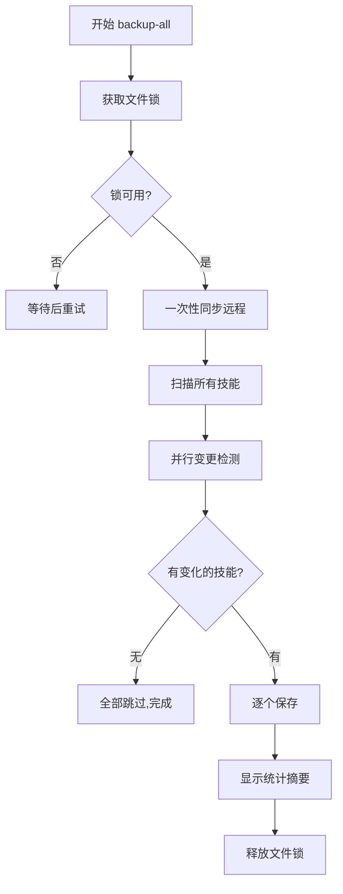

# Skill Snapshot

<div align="center">

**专业的 Claude Code 技能版本快照管理系统**

[](https://www.python.org/)
[](https://git-scm.com/)
[](https://cli.github.com/)
[](LICENSE)

为 Claude Code 技能创建 Git 版本快照，存储在 GitHub 私有仓库。支持由 Claude 自动管理技能的版本控制。

[特性](#-核心特性) • [快速开始](#-快速开始) • [命令参考](#-命令参考) • [FAQ](#-常见问题)

</div>

---

## 📋 目录

- [核心特性](#-核心特性)
- [系统要求](#-系统要求)
- [安装与配置](#-安装与配置)
- [快速开始](#-快速开始)
- [命令参考](#-命令参考)
- [高级功能](#-高级功能)
- [工作原理](#-工作原理)
- [故障排除](#-故障排除)
- [常见问题](#-常见问题)

---

## 🌟 核心特性

### 版本控制管理

| 功能 | 描述 |
|------|------|
| **快照保存** | 为每个技能创建带版本标签的 Git 快照 |
| **版本恢复** | 安全地将技能恢复到任意历史版本 |
| **变更对比** | 可视化显示当前代码与快照的差异 |
| **批量备份** | 一键备份所有技能，智能跳过未变更项 |
| **快照删除** | 清理不需要的旧版本快照 |

### 性能优化

> **🚀 哈希缓存系统** - 基于 SHA256 文件哈希的智能增量备份

- **10-20倍性能提升**：`backup-all` 命令智能跳过未变更的技能
- **增量检测**：仅重新计算变更文件的哈希值
- **跨平台兼容**：使用统一的时间戳和文件大小判断
- **自动维护**：缓存自动更新，无需手动干预

### 安全机制

| 安全特性 | 说明 |
|---------|------|
| **🔒 私有仓库** | 使用 GitHub 私有仓库存储，确保数据安全 |
| **🛡️ 自我保护** | 防止对 `skill-snapshot` 工具自身的回滚操作 |
| **🔄 安全恢复** | 恢复前自动备份，失败时自动回滚 |
| **🔐 敏感文件过滤** | 自动排除 `.env`、密钥文件等敏感信息 |
| **🔂 并发控制** | 文件锁机制防止并发操作冲突 |

### 智能过滤

自动跳过无需备份的内容：
- 开发环境目录（`.git/`、`__pycache__/`、`node_modules/`）
- 系统文件（`.DS_Store`、`Thumbs.db`）
- 超大技能（> 10MB）
- 符号链接和隐藏目录
- 归档目录（`archive/`）

---

## 📦 系统要求

| 依赖项 | 版本要求 | 用途 | 安装命令 |
|--------|----------|------|----------|
| **Python** | 3.7+ | 核心脚本运行 | [python.org](https://www.python.org/) |
| **Git** | 任意版本 | 版本控制 | `winget install Git.Git` (Windows) |
| **GitHub CLI** | 任意版本 | GitHub API 操作 | `winget install GitHub.cli` (Windows) |

> **macOS 用户**：使用 Homebrew 安装：`brew install git gh`

### 首次使用前准备

1. **安装 GitHub CLI 后需完成认证**：
   ```bash
   gh auth login
   ```
   按提示选择 GitHub.com、HTTPS、和 "Login with a web browser"。

2. **验证安装**：
   ```bash
   git --version
   gh --version
   python --version
   ```

---

## 🚀 安装与配置

### 方式一：作为 Claude Code 技能使用（推荐）

1. 将 `skill-snapshot` 目录放置在您的 Claude Code 技能目录：
   ```
   ~/.claude/skills/skill-snapshot/
   ```

2. 在 Claude Code 中直接调用：
   ```
   使用 skill-snapshot 保存我的技能快照
   ```

### 方式二：独立使用

```bash
# 克隆或下载项目
cd skill-snapshot

# 初始化快照仓库
python scripts/snapshot_manager.py init
```

### 目录结构

```
skill-snapshot/
├── SKILL.md                 # Claude Code 技能定义
├── README.md                # 本文档
├── .gitignore               # Git 忽略规则
├── scripts/
│   ├── snapshot_manager.py  # 核心管理脚本（统一入口）
│   ├── init.ps1/init.sh     # 平台特定初始化脚本
│   ├── save.ps1/save.sh     # 平台特定保存脚本
│   └── ...                  # 其他平台脚本
├── tests/
│   └── test_snapshot_manager.py
└── references/
    ├── commands.md          # 详细命令参考
    └── errors.md            # 故障排除指南
```

---

## ⚡ 快速开始

### 1️⃣ 初始化仓库（首次必须）

```bash
python scripts/snapshot_manager.py init
```

**执行内容**：
- ✅ 检查 GitHub CLI 认证状态
- ✅ 创建 GitHub 私有仓库 `skill-snapshots`（如不存在）
- ✅ 初始化本地 Git 仓库
- ✅ 配置远程同步
- ✅ 设置 `.gitignore` 排除缓存目录

### 2️⃣ 扫描可用技能

```bash
python scripts/snapshot_manager.py scan
```

**输出示例**：
```
=== Scanning Skills ===
Skills Directory: C:\Users\YourName\.claude\skills
- algorithmic-art
- auto-code-review
- crawler-launcher
- gemini-image
- md_translate

Found 5 skills.
```

### 3️⃣ 保存技能快照

```bash
# 保存单个技能
python scripts/snapshot_manager.py save crawler-launcher "优化爬虫启动逻辑"

# 使用当前时间戳作为说明（省略消息）
python scripts/snapshot_manager.py save crawler-launcher
```

**输出示例**：
```
=== Saving Snapshot for crawler-launcher ===
Version: v2
Message: 优化爬虫启动逻辑
Pushing to remote...
Snapshot saved: crawler-launcher/v2
```

### 4️⃣ 查看所有快照

```bash
python scripts/snapshot_manager.py list-all
```

**输出示例**：
```
SNAPSHOT                       | MESSAGE
------------------------------------------------------------
crawler-launcher/v2            | 优化爬虫启动逻辑
crawler-launcher/v1            | 最近修改快照
gemini-image/v4                | 升级新版本
md_translate/v3                | 版本更新
```

### 5️⃣ 恢复历史版本

```bash
# 查看可用版本
python scripts/snapshot_manager.py restore crawler-launcher

# 恢复到 v1
python scripts/snapshot_manager.py restore crawler-launcher v1
```

---

## 📖 命令参考

### 核心命令

| 命令 | 参数 | 描述 |
|------|------|------|
| `init` | 无 | 初始化快照仓库（首次使用必须） |
| `scan` | 无 | 扫描并列出所有可备份的技能 |
| `status` | 无 | 显示仓库状态、缓存状态和技能变更情况 |
| `save` | `<技能名> ["说明"]` | 保存技能快照 |
| `list` | `[技能名]` | 列出快照（可指定技能） |
| `list-all` | 无 | 列出所有技能的所有快照 |
| `restore` | `<技能名> [版本]` | 恢复技能到指定版本 |
| `delete` | `<技能名> <版本>` | 删除指定快照 |
| `diff` | `<技能名> [版本]` | 对比当前代码与快照差异 |
| `backup-all` | `["说明"]` | 批量备份所有变更的技能 |

### 缓存维护命令

| 命令 | 参数 | 描述 |
|------|------|------|
| `rebuild-cache` | `[技能名]` | 重建哈希缓存（省略参数则重建所有） |
| `clear-cache` | `[技能名]` | 清除缓存（省略参数则清除所有） |

### 命令详细说明

#### 1. `init` - 初始化仓库

```bash
python scripts/snapshot_manager.py init
```

**功能**：
- 检查并创建 GitHub 私有仓库
- 初始化本地 Git 仓库
- 配置远程同步
- 设置 `.gitignore`

**注意事项**：
- 首次使用必须执行
- 需要提前完成 `gh auth login`
- 仓库名称固定为 `skill-snapshots`

#### 2. `scan` - 扫描技能

```bash
python scripts/snapshot_manager.py scan
```

**输出内容**：
- 所有可备份的技能列表
- 跳过的技能及原因

**自动跳过**：
- `archive/` 目录
- 符号链接
- `skill-snapshot` 自身
- 超过 10MB 的技能
- 缺少 `SKILL.md` 的目录

#### 3. `status` - 查看状态

```bash
python scripts/snapshot_manager.py status
```

**输出示例**：
```
=== Skill Snapshot Status ===

📁 Repository Status:
  - Branch: main
  - Local changes: Yes (uncommitted)

📦 Cache Status:
  - Location: C:\Users\YourName\.claude\skill-snapshots\.snapshot_cache
  - Cached skills: 26
  - Cache version: 1.0

🔍 Skills Change Detection:
  - Total skills: 25
  - Changed: 2
  - Unchanged: 23

⚠️  Skills with changes:
    • crawler-launcher
    • gemini-image
```

#### 4. `save` - 保存快照

```bash
python scripts/snapshot_manager.py save <技能名> ["说明"]
```

**版本规则**：
- 自动递增版本号（v1, v2, v3...）
- Git 标签格式：`<技能名>/v<N>`
- 例如：`crawler-launcher/v2`

**智能优化**：
- 快速变更检测：无变化时跳过保存
- 自动同步远程仓库
- 更新哈希缓存

**示例**：
```bash
# 带说明保存
python scripts/snapshot_manager.py save my-skill "修复登录问题"

# 使用默认说明
python scripts/snapshot_manager.py save my-skill
```

#### 5. `restore` - 恢复快照

```bash
# 查看可用版本
python scripts/snapshot_manager.py restore <技能名>

# 恢复到指定版本
python scripts/snapshot_manager.py restore <技能名> <版本>
```

**安全机制**：
1. ✅ 恢复前自动备份当前版本
2. ✅ 恢复失败时自动回滚
3. ✅ 禁止恢复 `skill-snapshot` 自身
4. ✅ 支持相对版本号（v1）和完整标签（skill/v1）

**示例**：
```bash
# 查看 gemini-image 的版本
python scripts/snapshot_manager.py restore gemini-image
# 输出：
# gemini-image/v4
# gemini-image/v3
# gemini-image/v2
# gemini-image/v1
# Usage: restore gemini-image <version>

# 恢复到 v3
python scripts/snapshot_manager.py restore gemini-image v3
```

#### 6. `diff` - 对比差异

```bash
# 与最新快照对比
python scripts/snapshot_manager.py diff <技能名>

# 与指定版本对比
python scripts/snapshot_manager.py diff <技能名> v1
```

**输出内容**：
- 新增文件（绿色 `[+]`）
- 删除文件（红色 `[-]`）
- 修改文件（青色 `[~]`）及差异详情

**示例输出**：
```
=== Diff: Local vs gemini-image/v3 ===
[+] Added: scripts/new_feature.py
[-] Removed: tests/old_test.py
[~] Modified: SKILL.md
```

#### 7. `backup-all` - 批量备份

```bash
python scripts/snapshot_manager.py backup-all ["统一说明"]
```

**执行流程**：
1. 扫描所有技能
2. 使用哈希缓存检测变更
3. 列出有变更的技能
4. 批量备份变更的技能
5. 显示统计摘要

**性能优势**：
- 跳过未变更的技能
- 一次性同步远程仓库
- 智能哈希缓存

**输出示例**：
```
=== Backing Up All Skills ===
Syncing with remote...
Found 25 skills to backup.

Scanning for changes...
  ✓ crawler-launcher: Changes detected
  - algorithmic-art: No changes
  - gemini-image: Changes detected
  ... and 22 more with no changes

2 skill(s) with changes:
  • crawler-launcher
  • gemini-image

=== Backing up 2 modified skills ===

[1/2] Processing crawler-launcher...
Snapshot saved: crawler-launcher/v3

[2/2] Processing gemini-image...
Snapshot saved: gemini-image/v5

============================================================
Backup complete!

Results:
  - Scanned: 25 skills
  - Had changes: 2 skills
  - Successfully backed up: 2/2 skills
  - Unchanged (skipped): 23 skills
```

#### 8. `delete` - 删除快照

```bash
python scripts/snapshot_manager.py delete <技能名> <版本>
```

**功能**：
- 同时删除本地和远程标签
- 验证版本存在性
- 防止误删其他技能的版本

**示例**：
```bash
python scripts/snapshot_manager.py delete my-skill v1
```

---

## 🔧 高级功能

### 哈希缓存系统

> 技能快照的核心性能优化技术

#### 工作原理

1. **文件级哈希计算**：使用 SHA256 算法计算每个文件的哈希值
2. **增量检测**：通过对比文件修改时间（mtime）和大小，重用未变更文件的哈希
3. **智能跳过**：`backup-all` 时跳过哈希未变的技能

#### 缓存结构

**存储位置**：
```
~/.claude/skill-snapshots/.snapshot_cache/
├── crawler-launcher.json
├── gemini-image.json
└── ...
```

**缓存内容示例**：
```json
{
  "cache_version": "1.0",
  "last_backup": "2026-02-02T13:29:13.123456",
  "files": {
    "SKILL.md": {
      "hash": "a3f5e8d2c4b1...",
      "mtime": 1738469353.123456,
      "size": 2048
    },
    "scripts/main.py": {
      "hash": "f7b2c9e4d1a6...",
      "mtime": 1738469360.789012,
      "size": 4096
    }
  }
}
```

#### 缓存维护

```bash
# 重建所有技能的缓存
python scripts/snapshot_manager.py rebuild-cache

# 重建特定技能的缓存
python scripts/snapshot_manager.py rebuild-cache my-skill

# 清除所有缓存
python scripts/snapshot_manager.py clear-cache

# 清除特定技能的缓存
python scripts/snapshot_manager.py clear-cache my-skill
```

### 敏感文件保护

以下文件模式**自动排除**在快照之外：

| 模式 | 说明 |
|------|------|
| `.env`, `.env.*` | 环境变量文件 |
| `*.pem`, `*.key`, `*.crt` | 证书和密钥 |
| `id_rsa`, `id_dsa` | SSH 密钥 |
| `*.log` | 日志文件 |
| `__pycache__/` | Python 字节码缓存 |
| `.pytest_cache/` | pytest 缓存 |
| `.DS_Store`, `Thumbs.db` | 系统元数据文件 |
| `.git/`, `.venv/`, `node_modules/` | 版本控制和依赖目录 |

### 自定义配置

#### 修改技能大小限制

编辑 `scripts/snapshot_manager.py`：

```python
# 默认 10MB 限制
MAX_SKILL_SIZE_MB = 10
MAX_SKILL_SIZE_BYTES = MAX_SKILL_SIZE_MB * 1024 * 1024
```

#### 修改缓存位置

```python
# 默认路径
LOCAL_REPO = Path.home() / ".claude" / "skill-snapshots"
CACHE_DIR = LOCAL_REPO / ".snapshot_cache"
```

#### 修改仓库分支

```python
# 默认使用 main 分支
DEFAULT_BRANCH = "main"
```

---

## 🏗️ 工作原理

### 架构概览

```
┌─────────────────────────────────────────────────────────────┐
│                     Claude Code 技能目录                      │
│                   ~/.claude/skills/                          │
│  ┌─────────────┐  ┌─────────────┐  ┌─────────────┐          │
│  │ my-skill/   │  │ auto-code/  │  │ pdf/        │          │
│  │ └── SKILL.md│  │ └── SKILL.md│  │ └── SKILL.md│          │
│  └─────────────┘  └─────────────┘  └─────────────┘          │
└─────────────────────────────────────────────────────────────┘
                            │
                            ▼
┌─────────────────────────────────────────────────────────────┐
│              Skill Snapshot Manager (核心引擎)               │
│  ┌──────────────┐  ┌──────────────┐  ┌──────────────┐       │
│  │ 哈希缓存系统  │  │ Git 版本控制 │  │ GitHub API   │       │
│  │              │  │              │  │              │       │
│  │ • 增量检测   │  │ • 标签管理   │  │ • 私有仓库   │       │
│  │ • SHA256计算 │  │ • 提交管理   │  │ • 远程同步   │       │
│  └──────────────┘  └──────────────┘  └──────────────┘       │
└─────────────────────────────────────────────────────────────┘
                            │
                            ▼
┌─────────────────────────────────────────────────────────────┐
│              GitHub 私有仓库                                  │
│         github.com/<user>/skill-snapshots                   │
│  ┌─────────────┐  ┌─────────────┐  ┌─────────────┐          │
│  │ my-skill/   │  │ auto-code/  │  │ Tags:       │          │
│  │ • SKILL.md  │  │ • SKILL.md  │  │ • my-skill/│          │
│  │ • scripts/  │  │ • scripts/  │  │   v1, v2... │          │
│  └─────────────┘  └─────────────┘  └─────────────┘          │
└─────────────────────────────────────────────────────────────┘
```

### 执行流程

#### 保存快照流程



#### 批量备份流程



### 文件锁定机制

防止并发操作导致的数据损坏：

- **锁文件位置**：`~/.claude/skill-snapshots/.snapshot.lock`
- **锁超时**：10 分钟后自动释放
- **锁内容**：进程 ID 和时间戳

```python
# 锁定期间其他操作会等待
if not self._acquire_lock():
    raise SnapshotError("Another snapshot operation is in progress. Please wait.")
```

---

## 🔍 故障排除

### 常见错误与解决方案

| 错误信息 | 可能原因 | 解决方案 |
|----------|----------|----------|
| `gh: command not found` | 未安装 GitHub CLI | `winget install GitHub.cli` (Windows) 或 `brew install gh` (macOS) |
| `Not logged in to GitHub CLI` | GitHub CLI 未认证 | 执行 `gh auth login` 并按提示完成登录 |
| `No network connectivity` | 网络不可用或 GitHub 访问受限 | 检查网络连接，确认能访问 GitHub API |
| `Snapshot repository not initialized` | 本地仓库未初始化 | 执行 `python scripts/snapshot_manager.py init` |
| `Skill 'xxx' not found` | 技能名称拼写错误或不存在 | 使用 `scan` 命令查看正确的技能名称 |
| `Version 'xxx' not found` | 版本号格式错误或不存在 | 使用 `list <技能名>` 查看可用版本 |
| `Cannot save 'skill-snapshot'` | 尝试操作工具自身 | 这是安全限制，无法绕过 |
| `Another operation is in progress` | 并发操作冲突 | 等待当前操作完成（最多 10 分钟） |

### 调试技巧

#### 1. 检查仓库状态

```bash
python scripts/snapshot_manager.py status
```

#### 2. 查看详细日志

在 Python 脚本中添加详细输出：

```python
import logging
logging.basicConfig(level=logging.DEBUG)
```

#### 3. 手动 Git 操作

```bash
cd ~/.claude/skill-snapshots
git status
git log --oneline -10
git tag -l "my-skill/*"
```

#### 4. 清除并重建缓存

```bash
python scripts/snapshot_manager.py clear-cache
python scripts/snapshot_manager.py rebuild-cache
```

### 权限问题

**Windows PowerShell 编码问题**：

如果看到中文乱码，确保 PowerShell 使用 UTF-8：

```powershell
[Console]::OutputEncoding = [System.Text.Encoding]::UTF8
$env:PYTHONIOENCODING = "utf-8"
```

---

## ❓ 常见问题

### 一般问题

**Q: Skill Snapshot 与 Git 有什么区别？**

A: Skill Snapshot 是基于 Git 的高级封装，专门为 Claude Code 技能设计：
- 自动管理版本标签（v1, v2, v3...）
- 智能哈希缓存提升性能
- 自动过滤敏感文件
- 一键批量备份所有技能
- 与 Claude Code 无缝集成

**Q: 快照存储在哪里？**

A: 存储在两个位置：
1. **本地**：`~/.claude/skill-snapshots/`
2. **远程**：GitHub 私有仓库 `github.com/<用户名>/skill-snapshots`

**Q: 能否使用自托管的 Git 服务器？**

A: 目前工具默认使用 GitHub。要使用其他服务器，需要修改 `snapshot_manager.py` 中的仓库创建逻辑。

**Q: 如何导出快照到其他位置？**

A: 快照本质是 Git 仓库，可以使用标准 Git 命令：
```bash
cd ~/.claude/skill-snapshots
git archive --format=zip --output=my-skill.zip my-skill/v2
```

### 性能问题

**Q: 为什么 `backup-all` 比逐个保存快？**

A: 哈希缓存系统的优化：
- 跳过未变更的技能（无需 Git 操作）
- 一次性同步远程仓库
- 增量哈希计算（仅重新计算变更文件）

**Q: 缓存占用多少空间？**

A: 每个技能的缓存通常仅几 KB，包含文件路径、哈希、时间戳和大小信息。

**Q: 如何禁用缓存？**

A: 可以删除缓存目录，但不推荐（性能会显著下降）：
```bash
rm -rf ~/.claude/skill-snapshots/.snapshot_cache
```

### 安全问题

**Q: 快照是否包含敏感信息？**

A: 工具自动排除常见敏感文件（`.env`、密钥文件等），但建议：
- 定期审查快照内容
- 使用私有仓库
- 不要在快照说明中包含敏感信息

**Q: 能否加密快照？**

A: 可以使用 Git 加密工具（如 `git-crypt`），需要额外配置。

**Q: 为什么不能操作 `skill-snapshot` 自身？**

A: 这是安全设计：
- 防止意外破坏工具自身
- 避免运行时脚本被替换
- 确保工具始终可用

### 集成问题

**Q: 如何在 CI/CD 中使用？**

A: 可以集成到自动化流程：
```bash
# GitHub Actions 示例
- name: Backup skills
  run: |
    gh auth login --with-token <<< ${{ secrets.GITHUB_TOKEN }}
    python scripts/snapshot_manager.py backup-all "CI backup"
```

**Q: 能否与其他 Claude Code 工具集成？**

A: 可以通过以下方式集成：
- 在技能的 SKILL.md 中添加快照命令
- 创建预提交钩子自动保存快照
- 使用 Claude Code 的任务调度功能

---

## 📚 更多资源

- **[完整命令参考](references/commands.md)** - 所有命令的详细说明
- **[故障排除指南](references/errors.md)** - 深入的调试信息
- **[GitHub CLI 文档](https://cli.github.com/manual/)** - GitHub CLI 官方文档
- **[Git 文档](https://git-scm.com/doc)** - Git 版本控制文档

---

## 📄 许可证

MIT License - 详见 [LICENSE](LICENSE) 文件

---

## 🤝 贡献

欢迎提交 Issue 和 Pull Request！

### 开发环境设置

```bash
# 克隆仓库
git clone <your-fork>

# 安装测试依赖
pip install pytest

# 运行测试
pytest tests/
```

