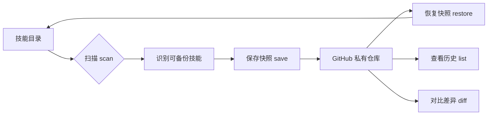
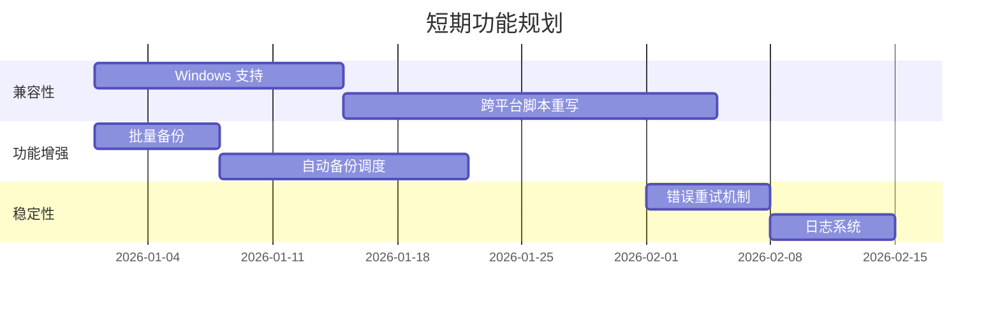

# Skill-Snapshot 技能分析评估报告

> **分析日期**：2026年1月11日  
> **分析人员**：Antigravity AI  
> **项目位置**：`c:\Users\38259\.claude\skills\skill-snapshot`

---

## 一、项目概述

### 1.1 基本信息

| 项目 | 内容 |
|------|------|
| **名称** | Skill-Snapshot |
| **用途** | 为 Claude Code 技能创建版本快照，支持版本回退 |
| **存储方式** | GitHub 私有仓库 |
| **技术栈** | Bash Shell 脚本 |
| **依赖工具** | GitHub CLI (`gh`)、Git |

### 1.2 核心功能

Skill-Snapshot 是一个专门为 Claude Code 技能设计的版本管理工具，提供以下核心能力：



---

## 二、文件结构分析

### 2.1 项目目录结构

```
skill-snapshot/
├── README.md          # 项目说明文档
├── SKILL.md           # Claude Code 技能定义文件
└── scripts/
    ├── init.sh        # 初始化私有仓库
    ├── save.sh        # 保存技能快照
    ├── restore.sh     # 恢复技能版本
    ├── list.sh        # 列出快照历史
    ├── diff.sh        # 对比版本差异
    └── scan.sh        # 扫描可备份技能
```

### 2.2 核心脚本功能详解

#### `init.sh` - 初始化脚本

**功能**：创建和配置 GitHub 私有仓库及本地克隆

**关键特性**：
- 自动获取 GitHub 用户名
- 检测仓库是否已存在
- 空仓库自动初始化（创建 README.md）
- 支持增量同步（`git pull`）

**代码亮点**：
```bash
export GCM_INTERACTIVE=never
export GIT_TERMINAL_PROMPT=0
```
禁用交互式凭证管理器，适合自动化环境。

---

#### `save.sh` - 保存快照

**功能**：将指定技能保存为版本快照

**关键特性**：
- 自动版本号递增（v1, v2, v3...）
- 支持自定义提交说明
- 清理临时文件（`.git`, `__pycache__`, `.DS_Store`）
- 智能检测无变化情况

**版本管理逻辑**：
```bash
# Git Tag 命名格式
<skill-name>/v<n>   # 如: my-skill/v1, my-skill/v2
```

---

#### `restore.sh` - 恢复快照

**功能**：将技能恢复到指定历史版本

**关键特性**：
- 恢复前自动备份当前版本到 `.snapshot-backup/`
- 支持版本列表查询
- 使用 `rsync` 精确同步文件
- 符号链接技能自动跳过

---

#### `list.sh` - 列出快照

**功能**：查看技能的版本历史

**两种模式**：
1. 无参数：列出所有技能的快照概览
2. 指定技能名：显示该技能的详细版本历史

---

#### `diff.sh` - 对比差异

**功能**：对比当前版本与某个历史快照的差异

**输出格式**：标准 Unix diff 格式

---

#### `scan.sh` - 扫描技能

**功能**：智能扫描识别哪些技能需要备份

**跳过规则**：

| 规则 | 原因 |
|------|------|
| `archive/` 目录 | 归档技能 |
| 符号链接 | 外部安装的技能 |
| `skill-snapshot` 自身 | 避免自引用 |
| 包含 `.git/` | 已有版本控制 |
| 包含 `.venv/` 或 `node_modules/` | 大型依赖目录 |
| 体积 > 10MB | 过大 |
| 缺少 `SKILL.md` | 非有效技能 |

---

## 三、优点分析

### 3.1 设计优点

| 优点 | 说明 |
|------|------|
| ✅ **私有存储** | 使用 GitHub 私有仓库，保护技能代码隐私 |
| ✅ **自动版本号** | 无需手动管理版本号，自动递增 |
| ✅ **智能跳过** | 自动识别不应备份的技能类型 |
| ✅ **恢复前备份** | 恢复操作前自动备份当前版本，防止数据丢失 |
| ✅ **清理临时文件** | 自动过滤 `.git`、`__pycache__` 等无关文件 |
| ✅ **离线检测** | 在保存前检测是否有实际变化 |

### 3.2 代码质量优点

| 优点 | 说明 |
|------|------|
| ✅ **错误处理** | 使用 `set -e` 确保脚本在错误时立即退出 |
| ✅ **清晰的用户提示** | 中文提示信息，用户友好 |
| ✅ **模块化设计** | 每个脚本职责单一，易于理解和维护 |
| ✅ **环境变量配置** | 禁用 Git 交互提示，适合 CI/CD 环境 |

### 3.3 用户体验优点

| 优点 | 说明 |
|------|------|
| ✅ **触发词灵活** | 支持中英文多种触发词（"快照"、"snapshot"、"备份技能"等） |
| ✅ **无需记忆版本号** | 可通过 `list` 命令随时查询 |
| ✅ **增量操作** | 无变化时不创建新版本，节省空间 |

---

## 四、缺点分析

### 4.1 平台兼容性问题

> [!CAUTION]
> **严重问题**：该 Skill 仅支持 macOS 和 Linux，不支持 Windows！

```bash
# 依赖的 Unix 命令
rsync, du -sk, find, sed, sort -V
```

**影响**：Windows 用户（当前用户环境）无法直接使用这些脚本。

---

### 4.2 功能局限性

| 缺点 | 说明 |
|------|------|
| ❌ **无批量操作** | 不支持一键备份所有技能 |
| ❌ **无定时备份** | 缺少自动定时备份机制 |
| ❌ **无压缩功能** | 大技能可能占用较多 GitHub 空间 |
| ❌ **无加密选项** | 敏感技能缺少加密保护 |
| ❌ **无远程恢复** | 不支持从其他机器恢复到本地 |

### 4.3 错误处理不足

| 缺点 | 说明 |
|------|------|
| ❌ **网络错误处理** | 网络失败时缺乏重试机制 |
| ❌ **磁盘空间检查** | 恢复前未检查目标磁盘空间 |
| ❌ **并发控制** | 多实例同时运行可能导致冲突 |

### 4.4 用户体验问题

| 缺点 | 说明 |
|------|------|
| ❌ **编码显示问题** | 中文字符在某些终端可能乱码 |
| ❌ **进度指示缺失** | 大技能备份/恢复时无进度条 |
| ❌ **日志记录缺失** | 操作历史未记录到日志文件 |

---

## 五、改进优化建议

### 5.1 高优先级改进

#### 1. Windows 兼容层

```powershell
# 建议新增 PowerShell 版本脚本
scripts/
├── init.ps1
├── save.ps1
├── restore.ps1
├── list.ps1
├── diff.ps1
└── scan.ps1
```

**或者使用跨平台方案**：
- 改用 Python 脚本（跨平台兼容）
- 使用 Node.js 脚本

---

#### 2. 批量备份功能

```bash
# 建议新增 save-all.sh
#!/bin/bash
for skill in $(./scan.sh | grep "需要备份" | cut -d' ' -f2); do
    ./save.sh "$skill" "Auto backup $(date)"
done
```

---

#### 3. 增强错误处理

```bash
# 网络重试机制
retry_push() {
    local max_attempts=3
    local attempt=1
    while [ $attempt -le $max_attempts ]; do
        git push --quiet origin main && return 0
        echo "推送失败，重试 $attempt/$max_attempts..."
        sleep 2
        ((attempt++))
    done
    return 1
}
```

---

### 5.2 中优先级改进

| 改进项 | 具体方案 |
|--------|----------|
| **进度显示** | 使用 `pv` 或自定义进度条 |
| **日志记录** | 写入 `~/.claude/skill-snapshots/logs/` |
| **配置文件** | 支持 `~/.skill-snapshot.conf` |
| **压缩存储** | 使用 `git lfs` 或 `tar.gz` |

### 5.3 低优先级改进

| 改进项 | 具体方案 |
|--------|----------|
| **Web UI** | 提供简单的 Web 界面查看历史 |
| **通知集成** | 备份完成后发送通知 |
| **统计报表** | 生成技能备份统计报告 |

---

## 六、未来功能升级方向

### 6.1 短期路线图（1-3个月）



---

### 6.2 中期路线图（3-6个月）

| 功能模块 | 描述 |
|----------|------|
| **🔄 同步功能** | 多设备间技能同步 |
| **📦 技能商店集成** | 支持从社区导入/分享技能 |
| **🔐 加密备份** | 敏感技能加密存储 |
| **📊 分析仪表盘** | 技能使用统计和版本分析 |

---

### 6.3 长期愿景

```
┌─────────────────────────────────────────────────────────┐
│                   Skill 生态系统                         │
├─────────────────────────────────────────────────────────┤
│                                                         │
│   ┌───────────┐    ┌───────────┐    ┌───────────┐      │
│   │ 本地技能  │◄──►│ 云端存储  │◄──►│ 社区共享  │      │
│   └───────────┘    └───────────┘    └───────────┘      │
│         │                │                │             │
│         ▼                ▼                ▼             │
│   ┌─────────────────────────────────────────────┐      │
│   │           Skill-Snapshot Pro                │      │
│   │  • 多设备同步    • 团队协作                  │      │
│   │  • 版本分支      • CI/CD 集成                │      │
│   │  • 智能推荐      • 安全审计                  │      │
│   └─────────────────────────────────────────────┘      │
│                                                         │
└─────────────────────────────────────────────────────────┘
```

---

## 七、总结评分

| 维度 | 评分 | 说明 |
|------|:----:|------|
| **功能完整性** | ⭐⭐⭐⭐☆ | 核心功能完备，缺少批量/定时 |
| **代码质量** | ⭐⭐⭐⭐☆ | 结构清晰，错误处理需加强 |
| **用户体验** | ⭐⭐⭐☆☆ | 中文友好，但缺少进度和日志 |
| **平台兼容性** | ⭐⭐☆☆☆ | 仅支持 Unix 系统 |
| **可扩展性** | ⭐⭐⭐⭐☆ | 模块化设计便于扩展 |
| **综合评分** | **3.4/5** | 实用的版本管理工具，有提升空间 |

---

## 八、附录

### A. 触发词列表

| 触发词 | 语言 |
|--------|------|
| 快照 | 中文 |
| snapshot | 英文 |
| 保存技能 | 中文 |
| 备份技能 | 中文 |
| 回退技能 | 中文 |
| 恢复技能 | 中文 |
| restore skill | 英文 |
| /skill-snapshot | 斜杠命令 |

### B. 存储结构

```
~/.claude/skill-snapshots/          # 本地仓库
├── my-skill/
│   ├── SKILL.md
│   └── scripts/
├── another-skill/
│   └── SKILL.md
└── README.md

GitHub Tags:
├── my-skill/v1
├── my-skill/v2
└── another-skill/v1
```

### C. 系统要求

| 要求 | 版本 |
|------|------|
| GitHub CLI | 最新版本 |
| Git | 2.0+ |
| Bash | 4.0+ |
| macOS/Linux | 必需 |

---

*报告生成时间：2026-01-11 15:34*  
*分析工具：Antigravity AI*
